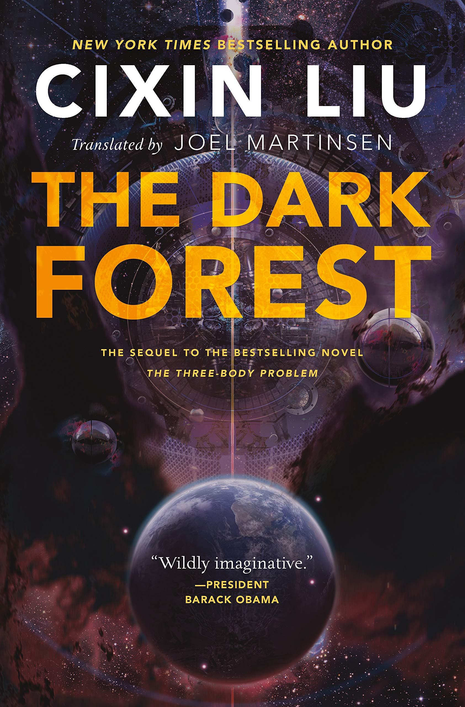
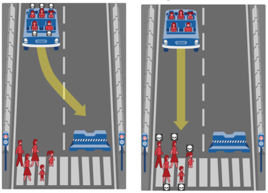

import { BlockMath as BM, InlineMath as IM } from "react-katex"

## Introduction

I originally read [The Three Body
Problem](https://www.goodreads.com/book/show/20518872-the-three-body-problem) by
Cixin Liu in December 2018. I had practically devoured it, enjoying the
imaginative thinking peppered with scientific concepts that simultaneously
stimulated my left and right brain. I promptly recommended the book to many
friends, along with the disclaimer that “I don’t normally enjoy fiction, but
this was something special” that, for some reason, I felt compelled to mention.

    

However, I never got around to reading its sequel, [The Dark
Forest](https://www.goodreads.com/book/show/23168817-the-dark-forest), until a
few weeks ago, roughly two years after reading the original. I read a quick
summary of The Three Body Problem to refresh my memory before diving in, though
I wouldn’t advise this if you have the option to read the series continuously.
The summary certainly did not do the original justice, and there were
undoubtedly plot points and other subtle aspects of characterization and context
that I had lost. I’ve heeded my own advice and, as of writing this, I've already
completed the final book of the trilogy, [Death’s
End](https://www.goodreads.com/book/show/25451264-death-s-end).

## Background

My goal is that anyone can understand this post even if they haven't read any of
the books in the series, so I'll first provide enough background information to
make that possible.

Earth is being invaded by an alien civilization called the Trisolarans, whose
own planet is uninhabitable due to the [chaotic
orbits](https://en.wikipedia.org/wiki/Three-body_problem) of its three suns. The
Trisolarans discover Earth through a broadcast made by an astrophysicist who has
become disillusioned with humanity, and embark to invade the planet in order to
settle where life appears to be more stable. The journey will take four
centuries, and so in order to prevent Earth from advancing enough to pose a
threat in this period, the Trisolarans deploy a swarm of supercomputers called
sophons. They are embedded in an unfolded and refolded 11-dimensional proton,
and are able to block humans from making certain technological advances. The
sophons are also able to act as surveillance drones delivering real-time
information to the Trisolaran fleet via quantum entanglement.

However, sophons cannot observe thought. This turns out to be a key difference
between the two civilizations: Trisolaran thought is transparent, and they are
therefore incapable of deceit.

As a result, the UN and other fictional UN-like organizations begin the
Wallfacer Project, in which four humans are selected to hatch plans to help
Earth and humanity survive the imminent invasion. Crucially, each Wallfacer's
plan should only be known to the Wallfacer himself, and he is encouraged to
intentionally mislead the public and, by extension, the Trisolarans.

## The Ideas

The Dark Forest is brimming with so many thought-provoking questions of
morality, philosophy, and science, that each could be the premise of a
standalone novel. In this post, I want to talk about just three ideas: the dark
forest theory and it’s game-theoretic consequences; freedom of thought; and the
trolley problem.

### Idea #1: The Dark Forest Theory

The only successful Wallfacer, Luo Ji, deduces an important theory of cosmic
sociology based on a couple axioms given to him by the same astrophysicist that
had broadcast Earth’s existence to the Trisolarans. Liu expertly and elegantly
outlines the deductive journey taken by Luo Ji to arrive at this conclusion, and
I won't attempt to reproduce that here. Instead, I'll summarize the core idea.

The titular dark forest theory is one possible answer to the [Fermi
paradox](https://en.wikipedia.org/wiki/Fermi_paradox), which poses the apparent
logical contradiction between the absence of evidence of extraterrestrial life
and the high probability that it exists in the vastness of our universe. The
theory resolves the contradiction by claiming that extraterrestrial
civilizations do exist, but they each intentionally conceal their existence for
fear of being terminated by some other, more powerful civilization. In this way,
the universe is a forest comprised of the hunters and the hunted, predators and
prey. However, since each entity is unaware of its own status in the total order
of power, it conservatively underestimates its own ability, for overestimating
it could lead to annihilation, and does not communicate outwardly thereby
shrouding the forest in darkness.

One of the book’s most exciting scenes involves a Machiavellian game of politics
played out by three human spaceships, each of which realizes that their own
resources will not be enough to support their journey. In an almost simultaneous
moment of revelation, they each realize that they must destroy the other ships
and claim their resources in order to ensure their own survival. What ensues is
a practical demonstration of the dark forest theory applied to this microcosm of
the universe. After the dust settles, there exists a single spaceship whose
survival was guaranteed through the elimination of the others.

A corollary of the dark forest theory is that one civilization can gain
persuasive power over another by threatening to broadcast the coordinates of the
latter’s home planetary system. Such an exposition would be akin to a torch
illuminating their corner of the forest, rendering them vulnerable to attack. In
the cosmic context, a civilization with the ability to commit mundicide will do
so without hesitation, in order to eliminate a potential threat. This is
precisely how Earth prevents the Trisolaran invasion. However, in this case,
broadcasting the coordinates of Trisolaris would also spell the destruction of
Earth, since the record of communication between the two civilizations can be
identified by a third party once one of them is discovered. Thus, Earth and
Trisolaris enter a state of peace built atop the mechanism of mutually assured
destruction.

This deterrence gives rise to an interesting dynamic that can be analyzed
through the lens of game theory. The two players, Earth and Trisolaris, are
engaged in something similar to, though not quite exactly, the Prisoner's
Dilemma.

The payoff matrix for this game would look something like this:

|                   | T Cooperates       | T Defects          |
| ----------------- | ------------------ | ------------------ |
| **E Cooperates**  | <IM>(0, 0)</IM>    | <IM>(-D, R)</IM>   |
| **E Defects**     | <IM>(-D, -D)</IM>  | <IM>(-D, -D)</IM>  |

In this case, we assume that the destruction of one's civilization has a
symmetric payoff, and incurs a cost of <IM>-D</IM> to both civilizations,
where <IM>D > 0</IM>, and the invasion of Earth bears a reward of <IM>R</IM> for the
Trisolarans.

Further, let's assume that if Trisolaris cooperates, Earth will not defect. That
is, the bottom-left cell occurs with probability <IM>P(E \space Defects \space | T
\space Cooperates) = 0</IM>.

Let's also denote the probability that Earth defects (i.e. broadcast the
location of Trisolaris' planetary system) given that Trisolaris does as well
as <IM>P(E \space Defects \space | T \space Defects) = p</IM>.

Then, the expected payoff for Trisolaris if they defect is:

<BM>E(T \space Defects) = (1-p)R - pD</BM>

When is this expected payoff positive? Setting this as an inequality and
rearranging, we get the following:

<BM>{"\\frac{R}{R + D} > p"}</BM>

This inequality becomes more interesting once it is revealed in Death's End that
Trisolaran mathematical modeling uncovers that for any <IM>p > 0.8</IM>, it is
not worthwhile to defect. As such, when <IM>p = 0.8</IM>, it must be the case
that <IM>E(T \space Defects) = 0</IM>. This gives us the following:

<BM>{"\\frac{R}{R + D} = 0.8"}</BM>

In other words, the Trisolarans seemed to value conquering the Earth four times
as much as the cost of having their civilization destroyed. Perhaps this is
telling of the desperation of the Trisolaran society, that their perceived gains
from settling in the Solar System was far greater than the perceived loss of
their home planet.

### Idea #2: Freedom of Thought

Bill Hines, a former president of the EU and neuroscientist by profession, is
one of the other Wallfacers.

Hines' leverages his neuroscience background in his plan, which involves
creating a technology that allows certain propositions to be programmed into the
human mind. Once programmed, the subject believes the proposition to be
undeniably true, despite facts or common sense. This effect is dubbed the
"mental seal".

Originally, it is believed that Hines' plan is to eradicate the Escapist
thinking that has plagued humanity during the crisis. This philosophy is deemed
to be problematic, since Escapism fundamentally violates human values of
equality and stands to break down the fabric of society. The proposition that
Hines offers to program in the minds of volunteers would help gain unwavering
confidence in humanity's victory in the war, thereby eliminating Escapist
thought.

It is revealed later that Hines secretly flipped a sign in part of the mental
seal program. This means that all volunteers who underwent the operation gained
unwavering confidence in the negation of the proposition. In other words, Hines
helped cement Escapist thinking in these people, who are eventually called the
Imprinted. Thus, Hines' actual plan all along was to bolster the Escapist
movement, which he believed to be humanity's best chance at survival.

Along the way, Hines receives much criticism for his plan due to the fact that
it encroaches on a central tenet of humanism: freedom of thought. The mental
seal is originally viewed as an extremely dangerous technology for its ability
to suppress this freedom. Thus, the technology is restricted to only operate on
one proposition, and only after the consent of the volunteer is given, and its
administration is highly regulated.

But it seems the technologies of our reality are not met with the same level of
caution. Why are the powerful algorithms that control the content we see on our
social media timelines and in our recommendations not subject to the same levels
of scrutiny and regulation? As a result of [echo
chambers](https://en.wikipedia.org/wiki/Echo_chamber_(media)) and [algorithmic
extremism](https://arxiv.org/abs/1912.11211), it's easy to consume information
that reaffirms and reinforces one's beliefs to polarizing levels. What makes our
reality stranger than fiction is that these algorithms are often black boxes,
their behavior unexplainable even to their creators. Explainable AI is therefore
an important area in which to invest research efforts to better understand the
algorithms that could shape individual and collective thought.

The idea of freedom of thought also relates to the theory of [linguistic
relativity](https://en.wikipedia.org/wiki/Linguistic_relativity), sometimes
called the Sapir-Whorf hypothesis. In short, the theory (specifically, its weak
variant) suggests that one's thought is influenced by their spoken language. The
strong variant of the theory proposes that thought is *determined* by language,
though it is generally agreed to be false by modern linguists.

Interestingly, the strong variant of the theory holds true for the Trisolarans,
since language and thought are exactly the same in their civilization. I
initially found the fact that the entire civilization shares a common language
to be slightly unrealistic, but upon learning that their language is equivalent
to thought, I found it to make more sense.

### Idea #3: The Trolley Problem

Finally, Frederick Tyler, a former US secretary of defense, is the last
Wallfacer I want to talk about.

Tyler's plan is publicly made to seem like a kamikaze operation. However, it is
later revealed by his Wallbreaker that the plan involves having the kamikaze
fighters betray part of Earth's space force to gain the trust of the
Trisolarans, provide the Trisolarans with a gift to further assimilate
themselves in Trisolaran society, and then to finally betray the Trisolarans.
Once the world finds out about his true plan, he is accused for conspiring to
commit crimes against humanity.

In the abstract, Tyler's plan is a formulation of [the trolley
problem](https://en.wikipedia.org/wiki/Trolley_problem), a famous ethical
thought experiment.

If the Earth was homogeneously utilitarian, Tyler's plan would not be met with
such opposition. The disutility of killing part of Earth's space force should be
less than the utility of saving the lives of billions. However, Earth is clearly
not so homogeneous and the plan is therefore scrutinized.

    

The trolley problem, in fact, is not so abstract. When I visited the MIT Media
Lab a few years ago, I came across the [Moral
Machine](https://en.wikipedia.org/wiki/Moral_Machine). At first blush, the
machine has the appearance of an arcade game. It generates moral dilemmas
similar in construction to the trolley problem, and asks the user to decide
which of the two options in the scenario is morally correct. In each scenario,
the user must weigh factors such as gender, age, and social status in order to
make their decision. In the aggregate, the results of these surveys inform how
ethics should be programmed into autonomous vehicles.

Unsurprisingly, the study showed large differences in moral preferences among
different countries and cultures. Empirically, there doesn't seem to be a
universal moral code. This suggests that there isn't an obvious way to draw
equivalences between numbers of human lives in order to measure utilities.

Tyler's plan is not a perfect instantiation of the trolley problem. If Tyler's
plan is not executed, it is not necessarily the case that all of humanity will
perish, so comparing it to the trolley problem turns out to create a false
dichotomy. Perhaps the glimmer of hope that humanity may survive by some means
that doesn't involve the intentional death of a single human was all that was
needed to confidently reject Tyler's plan.

## Concluding Thoughts

The entire trilogy is a fascinating and profound meditation on philosophy,
morality, politics, and more, all through the lens of Cixin Liu's universe.
While the fiction is certainly highly imaginative, it would be wrong to say it
doesn't simultaneously reflect many of the very real challenges and questions
that humanity faces today.