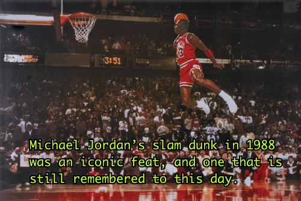
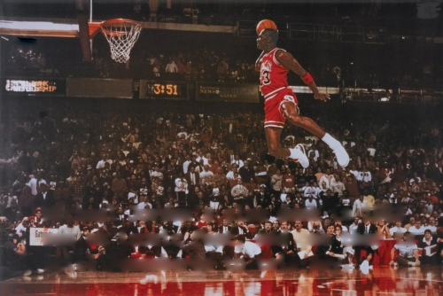
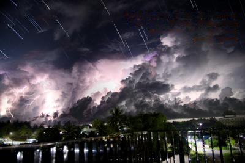
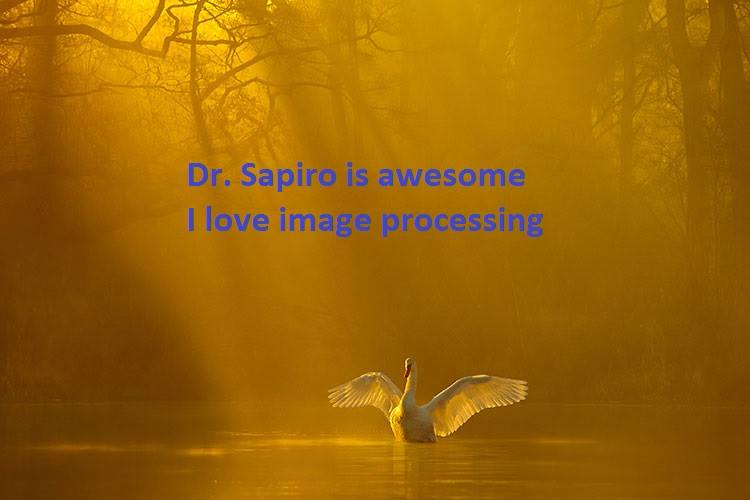
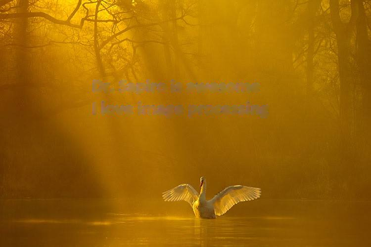
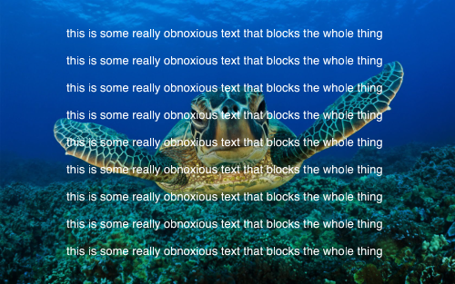
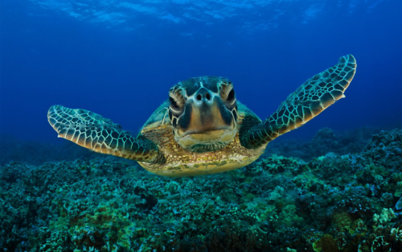

import { BlockMath as BM, InlineMath as IM } from "react-katex"

For my final project in ECE 590: Image and Video Processing (also a popular
[MOOC](https://www.coursera.org/learn/image-processing)), I worked with three
other teammates to build an application in MATLAB to detect text in images and
perform inpainting to remove it.

The application consists of four phases:

1. Input the image
2. Text detection
3. Perform inpainting
4. Post-processing

### 1. Input the image

The input image can be any one with some obscuring text to detect and remove.
Without loss of generality, the text can be of any font, weight, size, and
color, and appear in any part of the image.

### 2. Text detection

The application allows the user to select from four different methods of
detecting text:

##### Method 1: Edge Detection (Prewitt)

The Prewitt operator calculates the gradient of the image intensity at each
pixel and uses that information to detect edges at points where the changes are
most abrupt. Then, the edges are thickened in order to generate the mask to use
for inpainting.

##### Method 2: Otsu's Method

In the special case where the image has primarily two colors, with the text
being a different color from the underlying image, Otsu's method can be used to
automatically threshold the histogram and perform a segmentation, giving us the
desired text binary mask.

##### Method 3: Color-Select Mask

This algorithm takes user input for the text color and creates a mask
surrounding areas with a concentration of this color value.

##### Method 4: User Generated Mask

As a last resort, if a user finds the program is having difficulty isolating the
text specifically, the user can input a premade mask.

### 3. Perform inpainting

The Mumford-Shah functional is defined as follows, where <IM>I</IM> is the
particular image, <IM>D</IM> is some domain of the image, <IM>J</IM> is the
image’s model, and <IM>B</IM> are the boundaries associated with that model:

<BM>{`
    E[J, B] = C \\int_{D} (I(\\vec{x}) - J(\\vec{x}))^2 d\\vec{x} + A \\int_{\\frac{D}{B}} \\vec{\\nabla} J(\\vec{x}) \\cdot \\vec{\\nabla} J(\\vec{x}) d\\vec{x} + B \\int_{B} ds
`}</BM>

This functional is optimized by approximating it with another functional,
proposed by Ambrosio and Tortorelli:

<BM>{`
    u = argmin_u \\frac{\\alpha}{2} \\int \\Omega \\chi ^2 |\\nabla u|^2s dx + \\beta \\int \\Omega (\\epsilon |\\nabla \\chi|^2 + \\frac{(1 - \\chi)^2}{4\\epsilon}) dx
`}</BM>

This is solved iteratively via alternating solutions of the Euler-Lagrange
equations for <IM>u</IM> and <IM>x</IM>.

### 4. Post-processing

Finally, if median filters were used, the output image may need to be sharpened.

### Results

##### Edge Detection (Prewitt)

    
    

##### Color-Select Mask

    
    

##### Otsu's Method

    
    

##### User Generated Mask

    
    

